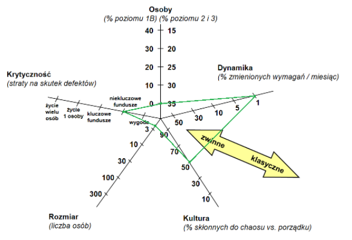

<h1>Dobór i adaptacja metodyki</h1>

<h2>Opis projektu</h2>

“Bikecorder” to rejestrator jazdy dla rowerzysty. Jest to kamera montowana na kierownicy, z wbudowanym akumulatorem, przesyłająca obraz bezpośrednio do smartfona. Dzięki aplikacji na telefonie, można nagrać swój przejazd rowerowy i zapisać go na dysku.

<h3>Zakres projektu</h3>
<ul>
  <li>Wykonanie aplikacji mobilnej</li>
  <li>Wykonanie urządzenia</li>
</ul>

<h3>Ograniczenia</h3>
<ul>
  <li>Czas - projekt musi zostać wykonany w około 6 miesięcy</li>
  <li>Ilość osób - zespół składa się tylko z dwóch osób</li>
  <li>Finansowe - końcowa cena produktu nie może przekroczyć pewnej kwoty</li>
</ul>

<h2>Ocena według modelu uproszczonego</h2>

<h3>Kryteria wyboru:</h3>
<ul>
  <li>Rozmiar - nasz zespół składa się z dwóch osób, a projekt będzie realizowany przez ponad 6 miesięcyRozmiar - nasz zespół składa się z dwóch osób, a projekt będzie realizowany przez ponad 6 miesięcy</li>
  <li>Krytyczność - w przypadku błędu w oprogramowaniu, istnieje mała szansa na spowodowanie strat materialnych u klienta (np. jeśli film miałby być dowodem w sądzie, a nie nagrał się poprawnie).</li>
  <li>Dynamika - nie przewidujemy zmian wymagań, więc zakładamy, że jeśli pojawią się jakieś zmiany, to obsłużymy ponad 80% z nich</li>
  <li>Osoby - uważamy, że w naszym zespole znajdują się wyłącznie osoby o poziomach świadomości metodyki 2. lub wyższych</li>
  <li>Kultura - w naszym zespole znajduje się jedna osoba skłonna do chaosu i jedna osoba preferująca porządek</li>
</ul>

Ze względu na rozmiar, krytyczność oraz osoby, lepszym rozwiązaniem będzie użycie metodyk zwinnych.

<h2>Ocena według zaadaptowanego modelu pełnego</h2>

<h3>Zastosowanie</h3>

<h4>Główne cele - podejście zwinne</h4>

Projekt musi zostać wykonany w określonym czasie (6 miesięcy), więc nie ma czasu na tworzenie obszernych planów. Wyjątek dotyczy specyfikacji sprzętowej urządzenia - ta musi być znana przed rozpoczęciem dalszych prac. Potrzebna jest szybka reakcja na ewentualne zmiany.

<h4>Środowisko - podejście mieszane</h4>

W przypadku "Bikecordera" liczy się "produkt w rękach", integracja i utrzymanie nie są brane pod uwagę. Nie ma też potrzeby szerokiego zakresu prac, jednak pewne wymagania muszą być znane od początku i nie można dostarczyć produktu w częściach (aplikacji i urządzenia).

<h3>Zarządzanie</h3>

<h4>Komunikacja - podejście zwinne</h4>

Ze względu na małą ilość osób w zespole, komunikacja będzie częsta i bezpośrednia, nie będzie tworzona nadmiarowa dokumentacja, tylko niezbędna.

<h3>Techniczne</h3>

<h4>Wymagania - podejście zwinne</h4>

Ze względu na wielkość realizowanego projektu wymagania będą oparte na elastycznych historyjkach. Specyfikacja i oprogramowanie są tworzone przez ten sam zespół.

<h4>Wytwarzanie - podejście klasyczne</h4>

Nie są przewidywane zmiany w projekcie, dlatego lepiej zastosować planowanie - pozwoli na stworzenie współdziałających ze sobą elementów (aplikacji oraz urządzenia).

<h3>Osoby</h3>

<h4>Klient - podejście zwinne</h4>

W projekt nie jest zaangażowana duża grupa udziałowców. Klient będzie uczestniczył w przedsięwzięciu, stąd niepotrzebny nam biurokratyczny nadzór.

<h4>Kultura - podejście zwinne</h4>

W przypadku tak małej liczby osób, które już się znają, lepiej sprawdzi się podejście “zakładu rzemieślniczego”. Nie ma potrzeby definowania wszystkich zasad i procedur.

<h2>Model dostarczania produktu końcowego projektu</h2>

Model przyrostowy - Kanban

<h2>Metodyka i jej adaptacja</h2>

Najlepszą metodyką wydaje się Kanban. Wizualizacja umożliwi śledzenie prac nad projektem, co jest ważne w przypadku ograniczonego czasu. Członkowie zespołu będą mogli sami wybierać sobie zadania, a w przypadku zmiany w projekcie, będzie można dodać nowe zadanie. Zastosowanie znajdzie też faza Inception z metodyki RUP, aby określić początkowe wytyczne dotyczące aspektów sprzętowych projektu
