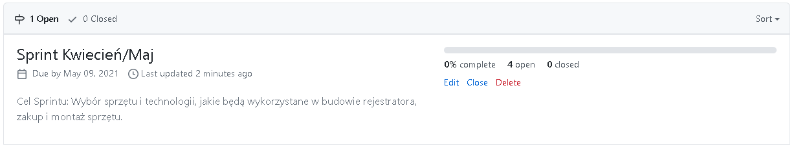
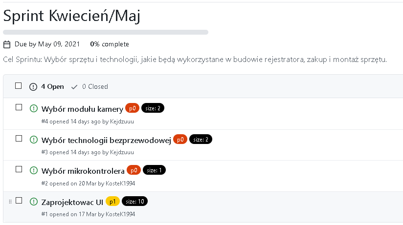
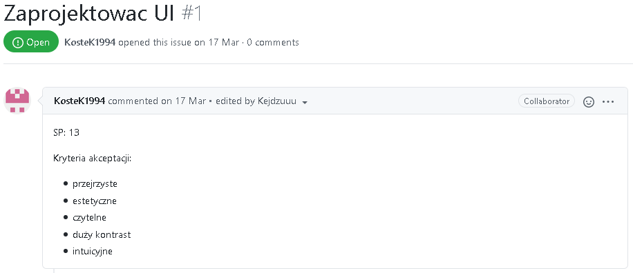
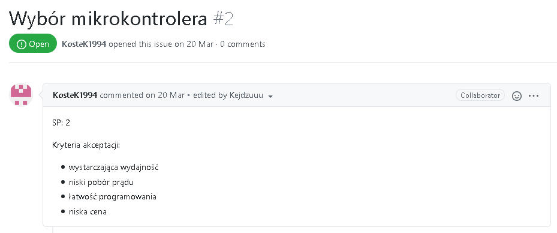
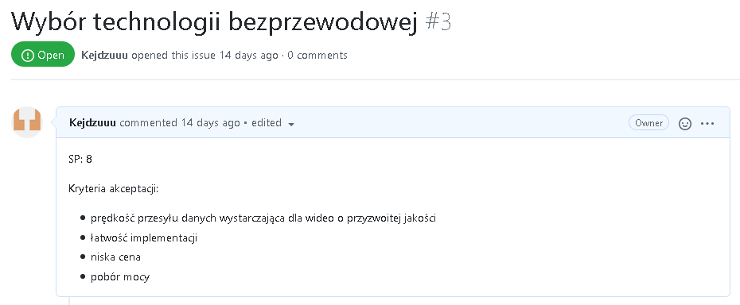
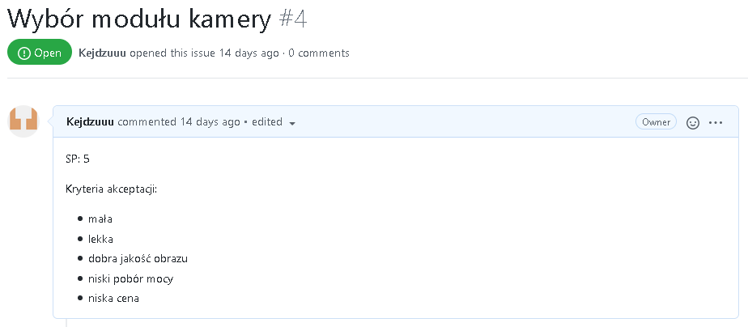

<h1>Backlog produktu</h1>

<h2>Przypomnienie produktu</h2>

“Bikecorder” to rejestrator jazdy dla rowerzysty. Jest to kamera montowana na kierownicy, z wbudowanym akumulatorem, przesyłająca obraz bezpośrednio do smartfona. Dzięki aplikacji na telefonie, można nagrać swój przejazd rowerowy i zapisać go na dysku

<h2>Oszacowanie rozmiaru backlogu produktu</h2>

Oszacowanie zostało wykonane metodą Planning Poker. Ponieważ jest nas tylko dwóch, było to szybkie i bezbolesne, po jednej rundzie i krótkiej dyskusji dochodziliśmy do porozumienia.

<h2>Założenia i dobór zakresu sprintu </h2>

Pojemność zespołu: ok. 15h 
Rezerwa na spotkania: 2h 
Zakładana prędkość zespołu: 15 SP / 15 h = 1 SP/h

Elementy z backlogu produktu wybrane do sprintu:
<ul>
    <li>Wybór mikrokontrolera</li>
    <li>Wybór technologii bezprzewodowej</li>
    <li>Wybór modułu kamery</li>
    <li>Zaprojektować UI</li>
</ul>
Wybraliśmy te elementy, ponieważ są one niezbędne, aby móc planować dalszy backlog i okntynuować pracę nad projektem.

<h2>Cel sprintu</h2>

<h2>Backlog sprintu</h2>

<h2>Kryteria akceptacji</h2>

    
    
    
    

<h2>Definicja ukończenia</h2>
<ul>
    <li>Spełniono kryteria akceptacji</li>
    <li>Jeśli element wymagał kodowania:</li>
        <ul>
            <li>Napisano kod</li>
            <li>Napisano testy</li>
            <li>Kod przetestowano</li>
            <li>Kod przeszedł peer review</li>
            <li>Kod i testy umieszczono w repozytorium</li>
        </ul>
    <li>Zaktualizowano backlog</li>
</ul>
